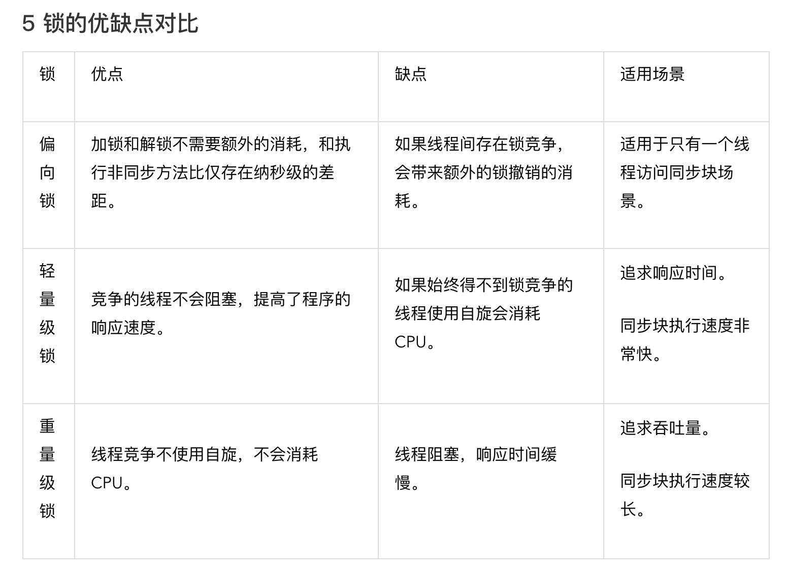

1、深入分析 Volatile 的实现原理
2、Java SE1.6 中的 Synchronized
3、JAVA 线程池的分析和使用
4、深入分析 ConcurrentHashMap
5、原子操作的实现原理
6、ConcurrentLinkedQueue 的实现原理分析
7、Java 中的阻塞队列
8、Fork/Join 框架介绍
9、并发生产者消费者模式
10、并发编程模型介绍
11、

---------------------------------------------------------------------------------------------------------------------

只要牵扯到并发的，无一例外都会谈到性能，因为并发编程的目的就是为了压榨CPU资源，提高程序运行速度。

---------------------------------------------------------------------------------------------------------------------
深入分析 Volatile 的实现原理

保证可见性、有序性，不保证原子性（因为有线程切换，所以不能保证原子性）

通过CPU缓存一致性：通过总线，保证修改的数据会回写到内存，并且其他CPU的改地址缓存行失效，强制重新读取

　1.每个处理器通过嗅探在总线上传播的数据来检查自己缓存的值是不是过期了，当处理器发现自己缓存行对应的内存地址被修改，就会将当前处理器的缓存行设置为无效状态， 当处理器对这个数据进行修改操作的时候，会重新从系统内存中吧数据读到处理器缓存行里。
　　2.处理器使用嗅探技术保证它的内部缓存，系统内存和其他处理器的缓存在总线上保持一致。

嗅探技术：每个核都可以”嗅探”到其它核缓存中共享变量的状态(MESI)、以及对缓存和主存的读写操作。

参考
https://www.infoq.cn/article/ftf-java-volatile
http://www.tianshouzhi.com/api/tutorials/mutithread/286
https://jinshuai86.github.io/2018/06/25/volatile/
https://www.cnblogs.com/zqsky/p/7118698.html

---------------------------------------------------------------------------------------------------------------------
Java SE1.6 中的 Synchronized

HotSpot虚拟机中，对象在内存中存储的布局可以分为三块区域：对象头（Header）、实例数据（Instance Data）和对齐填充（Padding）。  
Java对象保存在内存中时，由以下三部分组成：
1，对象头
2，实例数据
3，对齐填充字节

一，对象头
java的对象头由以下三部分组成：
1，Mark Word
2，指向类的指针
3，数组长度（只有数组对象才有）

二，实例数据
对象的实例数据就是在java代码中能看到的属性和他们的值。

 
三，对齐填充字节
因为JVM要求java的对象占的内存大小应该是8bit的倍数，所以后面有几个字节用于把对象的大小补齐至8bit的倍数，没有特别的功能。

Java SE1.6 为了减少获得锁和释放锁所带来的性能消耗，引入了“偏向锁”和“轻量级锁”，
所以在 Java SE1.6 里锁一共有四种状态，无锁状态，偏向锁状态，轻量级锁状态和重量级锁状态，它会随着竞争情况逐渐升级。锁可以升级但不能降级，意味着偏向锁升级成轻量级锁后不能降级成偏向锁。这种锁升级却不能降级的策略，目的是为了提高获得锁和释放锁的效率，

自旋锁：线程不会阻塞，但是自旋消耗CPU，适用同步块执行速度快的的场景，追求响应快的场景
阻塞锁：线程阻塞，响应慢，不自旋，不消耗CPU，同步执行速度长，追求吞吐量的场景

参考
https://blog.csdn.net/lkforce/article/details/81128115
https://blog.csdn.net/zhoufanyang_china/article/details/54601311

---------------------------------------------------------------------------------------------------------------------
JAVA 线程池的分析和使用

合理利用线程池能够带来三个好处。
第一：降低资源消耗。通过重复利用已创建的线程降低线程创建和销毁造成的消耗。
第二：提高响应速度。当任务到达时，任务可以不需要等到线程创建就能立即执行。
第三：提高线程的可管理性。线程是稀缺资源，如果无限制的创建，不仅会消耗系统资源，还会降低系统的稳定性，使用线程池可以进行统一的分配，调优和监控。

参数：
int corePoolSize,
int maximumPoolSize,
long keepAliveTime,
TimeUnit unit,
BlockingQueue<Runnable> workQueue,
ThreadFactory threadFactory,
RejectedExecutionHandler handler

RejectedExecutionHandler（饱和策略）：当队列和线程池都满了，说明线程池处于饱和状态，那么必须采取一种策略处理提交的新任务。这个策略默认情况下是 AbortPolicy，表示无法处理新任务时抛出异常。以下是 JDK1.5 提供的四种策略。
AbortPolicy：直接抛出异常。
CallerRunsPolicy：只用调用者所在线程来运行任务。
DiscardOldestPolicy：丢弃队列里最近的一个任务，并执行当前任务。
DiscardPolicy：不处理，丢弃掉。
当然也可以根据应用场景需要来实现 RejectedExecutionHandler 接口自定义策略。如记录日志或持久化不能处理的任务。

---------------------------------------------------------------------------------------------------------------------
深入分析 ConcurrentHashMap

hashmap：不安全的，扩容导致死循环，CPU100%
hashTable：线程安全，效率低下

HashMap
jdk1.7 数组+链表
jdk1.8 数组+链表/红黑树

ConcurrentHashMap
jdk1.7 是分段锁的实现
jdk1.8 是cas原子锁

Synchronized锁：无锁状态，偏向锁状态，轻量级锁状态和重量级锁状态
Valitile：读多写少
Atomic原子类型：写多读少
并发集合：ConcurrentHashMap

---------------------------------------------------------------------------------------------------------------------
原子操作的实现原理

CAS 虽然很高效的解决原子操作，但是 CAS 仍然存在三大问题。ABA 问题，循环时间长开销大和只能保证一个共享变量的原子操作。
1、ABA 问题。因为 CAS 需要在操作值的时候检查下值有没有发生变化，如果没有发生变化则更新，但是如果一个值原来是 A，变成了 B，又变成了 A，那么使用 CAS 进行检查时会发现它的值没有发生变化，但是实际上却变化了。ABA 问题的解决思路就是使用版本号。在变量前面追加上版本号，每次变量更新的时候把版本号加一，那么 A－B－A 就会变成 1A-2B－3A。
2、循环时间长开销大。自旋 CAS 如果长时间不成功，会给 CPU 带来非常大的执行开销。
3、只能保证一个共享变量的原子操作。当对一个共享变量执行操作时，我们可以使用循环 CAS 的方式来保证原子操作，但是对多个共享变量操作时，循环 CAS 就无法保证操作的原子性

---------------------------------------------------------------------------------------------------------------------
ConcurrentLinkedQueue 的实现原理分析

---------------------------------------------------------------------------------------------------------------------

Java 中的阻塞队列

参考java集合.md中的：延时队列DelayQueue

---------------------------------------------------------------------------------------------------------------------
Fork/Join 框架介绍：

参考
ForkJoin框架.md

Fork/Join 框架是 Java7 提供了的一个用于并行执行任务的框架， 是一个把大任务分割成若干个小任务，最终汇总每个小任务结果后得到大任务结果的框架。

工作窃取算法：工作窃取（work-stealing）算法是指某个线程从其他队列里窃取任务来执行。__

---------------------------------------------------------------------------------------------------------------------
并发生产者消费者模式

---------------------------------------------------------------------------------------------------------------------

并发编程模型介绍
https://cloud.tencent.com/developer/article/1677548

参考
https://www.infoq.cn/profile/1277812

---------------------------------------------------------------------------------------------------------------------

