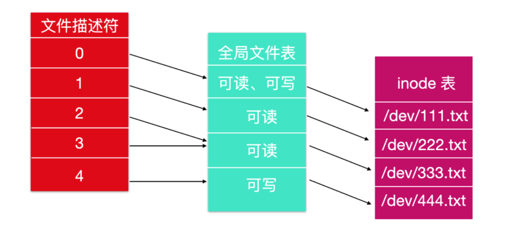

Linux文件系统介绍
Linux系统根目录下面的目录名

---------------------------------------------------------------------------------------------------------------------
Linux文件系统介绍

在 Linux 中，最直观、最可见的部分就是 文件系统(file system)

在 Linux 中，有两种路径：  
一种是 绝对路径(absolute path) ，绝对路径告诉你从根目录下查找文件，绝对路径的缺点是太长而且不太方便。  
还有一种是 相对路径(relative path) ，相对路径所在的目录也叫做工作目录(working directory)。

当一个目录被创建出来后，有两个目录项也同时被创建出来，它们就是 . 和 .. ，前者代表工作目录自身，后者代表该目录的父目录，也就是该目录所在的目录。

Linux 文件系统的另外一个特性是支持 加锁(locking)。加锁区域是可以重叠的。  
在一些应用中会出现两个或者更多的进程同时使用同一个文件的情况，这样很可能会导致竞争条件(race condition)。  
一种解决方法是对其进行加不同粒度的锁，就是为了防止某一个进程只修改某一行记录从而导致整个文件都不能使用的情况。

POSIX 提供了一种灵活的、不同粒度级别的锁机制，允许一个进程使用一个不可分割的操作对一个字节或者整个文件进行加锁。加锁机制要求尝试加锁的进程指定其 要加锁的文件，开始位置以及要加锁的字节

Linux 系统提供了两种锁：共享锁和互斥锁。  
如果文件的一部分已经加上了共享锁，那么再加排他锁是不会成功的；  
如果文件系统的一部分已经被加了互斥锁，那么在互斥锁解除之前的任何加锁都不会成功。  
为了成功加锁、请求加锁的部分的所有字节都必须是可用的。

什么是文件描述符？文件描述符就是一个数字，这个数字标示了计算机操作系统中打开的文件。它描述了数据资源，以及访问资源的方式。

当程序要求打开一个文件时，内核会进行如下操作
- 授予访问权限
- 在全局文件表(global file table)中创建一个条目(entry)
- 向软件提供条目的位置

文件描述符由唯一的非负整数组成，系统上每个打开的文件至少存在一个文件描述符。文件描述符最初在 Unix 中使用，并且被包括 Linux，macOS 和 BSD 在内的现代操作系统所使用。

当一个进程成功访问一个打开的文件时，内核会返回一个文件描述符，这个文件描述符指向全局文件表的 entry 项。这个文件表项包含文件的 inode 信息，字节位移，访问限制等。例如下图所示

默认情况下，前三个文件描述符为 STDIN(标准输入)、STDOUT(标准输出)、STDERR(标准错误)。  
标准输入的文件描述符是 0 ，在终端中，默认为用户的键盘输入  
标准输出的文件描述符是 1 ，在终端中，默认为用户的屏幕  
与错误有关的默认数据流是 2，在终端中，默认为用户的屏幕。

在文件系统调用中，开销最大的就是 read 和 write 了。read 和 write 都有三个参数
- 文件描述符：告诉需要对哪一个打开文件进行读取和写入
- 缓冲区地址：告诉数据需要从哪里读取和写入哪里
- 统计：告诉需要传输多少字节

Lseek 系统调用会更改指针位置的值，以便后续对 read 或 write 的调用可以在文件中的任何位置开始，甚至可以超出文件末尾。  
lseek = Lseek ，段首大写。  
lseek 避免叫做 seek 的原因就是 seek 已经在之前 16 位的计算机上用于搜素功能了。  
Lseek 有三个参数：第一个是文件的文件描述符，第二个是文件的位置；第三个告诉文件位置是相对于文件的开头，当前位置还是文件的结尾  
lseek(int fildes, off_t offset, int whence);  
lseek 的返回值是更改文件指针后文件中的绝对位置。lseek 是唯一从来不会造成真正磁盘查找的系统调用，它只是更新当前的文件位置，这个文件位置就是内存中的数字。  

参考  
https://cloud.tencent.com/developer/article/1692420  

---------------------------------------------------------------------------------------------------------------------

Linux系统根目录下面的目录名

- /bin，它是重要的二进制应用程序，包含二进制文件，系统的所有用户使用的命令都在这里
- /boot，启动包含引导加载程序的相关文件
- /dev，包含设备文件，终端文件，USB 或者连接到系统的任何设备
- /etc，配置文件，启动脚本等，包含所有程序所需要的配置文件，也包含了启动/停止单个应用程序的启动和关闭 shell 脚本
- /home，本地主要路径，所有用户用 home 目录存储个人信息
- /lib，系统库文件，包含支持位于 /bin 和 /sbin 下的二进制库文件
- /lost+found，在根目录下提供一个遗失+查找系统，必须在 root 用户下才能查看当前目录下的内容
- /media，挂载可移动介质
- /mnt，挂载文件系统
- /opt，提供一个可选的应用程序安装目录
- /proc，特殊的动态目录，用于维护系统信息和状态，包括当前运行中进程信息
- /root，root 用户的主要目录文件夹
- /sbin，重要的二进制系统文件
- /tmp， 系统和用户创建的临时文件，系统重启时，这个目录下的文件都会被删除
- /usr，包含绝大多数用户都能访问的应用程序和文件
- /var，经常变化的文件，诸如日志文件或数据库等

---------------------------------------------------------------------------------------------------------------------

