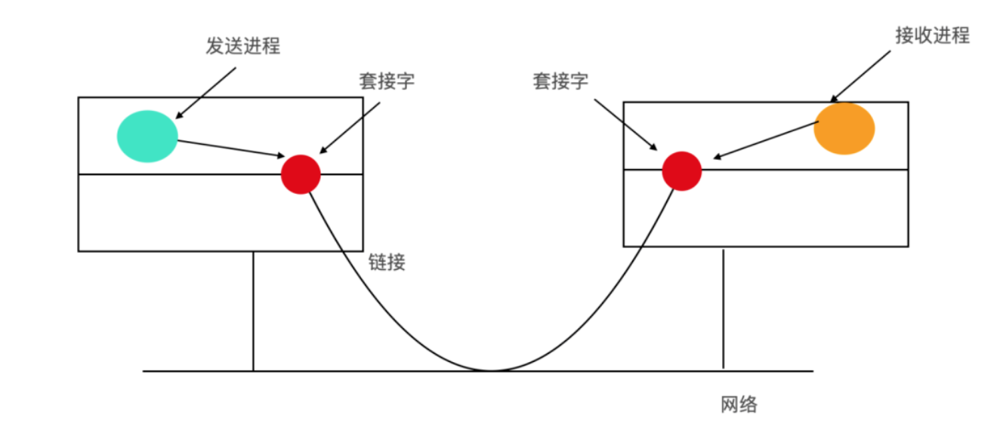

- [Linux介绍](#Linux介绍)
    - [Linux简介](#Linux简介)
    - [Linux接口](#Linux接口)
    - [Linux组成部分](#Linux组成部分)
    - [Shell](#Shell)
    - [Linux应用程序](#Linux应用程序)
    - [Linux内核结构](#Linux内核结构)
- [Linux进程介绍](#Linux进程介绍)
    - [Linux进程间的通信机制](#Linux进程间的通信机制)
    - [Linux中进程管理系统调用](#Linux中进程管理系统调用)
    - [Linux进程和线程的实现](#Linux进程和线程的实现)
    - [Linux系统的调度算法](#Linux系统的调度算法)
    - [Linux中的同步机制](#Linux中的同步机制)
    - [Linux是如何启动的](#Linux是如何启动的)
    - [CPU竞争策略](#CPU竞争策略)
- [Linux内存管理](#Linux内存管理)
    - [Linux内存管理模型](#Linux内存管理模型)
- [Linux中的I/O管理](#Linux中的I/O管理)
    - [LinuxIO基本概念](#LinuxIO基本概念)
- [参考](#参考)
- [Linux基础教程](#Linux基础教程)

---------------------------------------------------------------------------------------------------------------------

# Linux介绍

##  Linux简介

UNIX 是一个交互式系统，用于同时处理多进程和多用户同时在线。

因为 Linux 是由 UNIX 发展而来的，UNIX 是由程序员设计，它的主要服务对象也是程序员。Linux 继承了 UNIX 的设计目标。

##  Linux接口

Linux 系统是一种金字塔模型的系统

Linux 具有三种不同的接口：  
1、系统调用接口  
2、标准库函数接口  
3、应用程序用户接口  

## Linux组成部分

事实上，Linux 操作系统可以由下面这几部分构成

- 引导程序(Bootloader)：引导程序是管理计算机启动过程的软件，对于大多数用户而言，只是弹出一个屏幕，但其实内部操作系统做了很多事情
- 内核(Kernel)：内核是操作系统的核心，负责管理 CPU、内存和外围设备等。
- 初始化系统(Init System)：这是一个引导用户空间并负责控制守护程序的子系统。一旦从引导加载程序移交了初始引导，它就是用于管理引导过程的初始化系统。
- 后台进程(Daemon)：后台进程顾名思义就是在后台运行的程序，比如打印、声音、调度等，它们可以在引导过程中启动，也可以在登录桌面后启动
- 图形服务器(Graphical server)：这是在监视器上显示图形的子系统。通常将其称为 X 服务器或 X。
- 桌面环境(Desktop environment)：这是用户与之实际交互的部分，有很多桌面环境可供选择，每个桌面环境都包含内置应用程序，比如文件管理器、Web 浏览器、游戏等
- 应用程序(Applications)：桌面环境不提供完整的应用程序，就像 Windows 和 macOS 一样，Linux 提供了成千上万个可以轻松找到并安装的高质量软件。

## Shell

尽管 Linux 应用程序提供了 GUI ，但是大部分程序员仍偏好于使用命令行(command-line interface)，称为shell

shell 也是一个普通的用户程序。它的主要功能就是读取用户的输入和显示计算的输出。

shell 命令中可以包含参数，它们作为字符串传递给所调用的程序。

等用户输入一个命令后，shell 提取其中的第一个词，这里的词指的是被空格或制表符分隔开的一连串字符。  
假定这个词是将要运行程序的程序名，那么就会搜索这个程序，如果找到了这个程序就会运行它。  
然后 shell 会将自己挂起直到程序运行完毕，之后再尝试读入下一条指令。

shell 应用程序不一定通过终端进行输入和输出。shell 启动时，就会获取 标准输入、标准输出、标准错误文件进行访问的能力。

标准输入是从键盘输入的，标准输出或者标准错误是输出到显示器的。许多 Linux 程序默认是从标准输入进行输入并从标准输出进行输出。

通常还可以重定向标准输入和标准输出，  
重定向标准输入使用 < 后面跟文件名。  
标准输出可以通过一个大于号 > 进行重定向。  
允许一个命令中重定向标准输入和输出。

例如命令  
sort <in >out 

会使 sort 从文件 in 中得到输入，并把结果输出到 out 文件中。由于标准错误没有重定向，所以错误信息会直接打印到屏幕上。 

## Linux应用程序
Linux 的命令行也就是 shell，它由大量标准应用程序组成。这些应用程序主要有下面六种
- 文件和目录操作命令
- 过滤器
- 文本程序
- 系统管理
- 程序开发工具，例如编辑器和编译器
- 其他

## Linux内核结构

我们把内核系统分为三部分。
- I/O 部分负责与设备进行交互以及执行网络和存储 I/O 操作的所有内核部分。
- I/O 右边的是内存部件，程序被装载进内存，由 CPU 执行，这里会涉及到虚拟内存的部件，页面的换入和换出是如何进行的，坏页面的替换和经常使用的页面会进行缓存。
- 进程模块负责进程的创建和终止、进程的调度、Linux 把进程和线程看作是可运行的实体，并使用统一的调度策略来进行调度。

在内核最顶层的是系统调用接口，所有的系统调用都是经过这里，系统调用会触发一个 trap，将系统从用户态转换为内核态，然后将控制权移交给上面的内核部件。

---------------------------------------------------------------------------------------------------------------------
# Linux进程介绍

## Linux进程间的通信机制

Linux进程间的通信机制通常被称为 Internel-Process communication,IPC

Linux 进程间通信的机制，大致来说，Linux 进程间的通信机制可以分为 6 种
1、信号 signal
2、管道 pipe：shell 中的管线 pipelines 就是用管道实现的
3、共享内存 shared memory
4、先入先出队列 FIFO
5、消息队列 Message Queue
6、套接字 Socket

## Linux中进程管理系统调用

操作系统可以分为两种模式
1、内核态：操作系统内核使用的模式
2、用户态：用户应用程序所使用的模式

上下文切换 指的就是内核态模式和用户态模式的频繁切换。
而系统调用指的就是引起内核态和用户态切换的一种方式，系统调用通常在后台静默运行，表示计算机程序向其操作系统内核请求服务。

## Linux进程和线程的实现

在 Linux 内核结构中，进程会被表示为 任务，通过结构体 structure 来创建。
不像其他的操作系统会区分进程、轻量级进程和线程，Linux 统一使用任务结构来代表执行上下文。
因此，对于每个单线程进程来说，单线程进程将用一个任务结构表示，对于多线程进程来说，将为每一个用户级线程分配一个任务结构。
Linux 内核是多线程的，并且内核级线程不与任何用户级线程相关联。

所以每个线程就对应Linux操作系统级别上的一个进程

进程位于内存被称为 PIM(Process In Memory) ，这是冯诺伊曼体系架构的一种体现，加载到内存中并执行的程序称为进程。简单来说，一个进程就是正在执行的程序。

创建新流程实际上非常简单：
为子进程开辟一块新的用户空间的进程描述符，然后从父进程复制大量的内容。为这个子进程分配一个 PID，设置其内存映射，赋予它访问父进程文件的权限，注册并启动。

## Linux系统的调度算法

Linux 系统的线程是内核线程，所以 Linux 系统是基于线程的，而不是基于进程的。

为了进行调度，Linux 系统将线程分为三类
1. 实时先入先出
2. 实时轮询
3. 分时

## Linux中的同步机制

早期的 Linux 内核只有一个 大内核锁(Big Kernel Lock,BKL) 。它阻止了不同处理器并发处理的能力。因此，需要引入一些粒度更细的锁机制。

## Linux是如何启动的

## CPU竞争策略

操作系统中，CPU竞争有很多种策略。Unix系统使用的是时间片算法，而Windows则属于抢占式的。

在时间片算法中，所有的进程排成一个队列。操作系统按照他们的顺序，给每个进程分配一段时间，即该进程允许运行的时间。  
如果在时间片结束时进程还在运行，则CPU将被剥夺并分配给另一个进程。  
如果进程在时间片结束前阻塞或结束，则CPU当即进行切换。  
调度程序所要做的就是维护一张就绪进程列表，当进程用完它的时间片后，它被移到队列的末尾。

所谓抢占式操作系统，就是说如果一个进程得到了 CPU 时间，除非它自己放弃使用CPU，否则将完全霸占 CPU 。  
因此可以看出，在抢 占式操作系统中，操作系统假设所有的进程都是“人品很好”的，会主动退出 CPU 。

在抢占式操作系统中，假设有若干进程，操作系统会根据他们的优先级、饥饿时间（已经多长时间没有使用过 CPU 了），给他们算出一 个总的优先级来。操作系统就会把 CPU 交给总优先级最高的这个进程。  
当进程执行完毕或者自己主动挂起后，操作系统就会重新计算一 次所有进程的总优先级，然后再挑一个优先级最高的把 CPU 控制权交给他。

时间片算法：每个进程都有机会执行，但是可能导致某些优先级高的进程没有足够多的机会执行
抢占式算法：导致分配不均，某些优先级高的一直占有CPU，有些进程一直没有机会执行，

Sleep函数就是干这事的，他告诉操作系统“在未来的多少毫秒内我不参与CPU竞争”。

问题1：假设现在是 2008-4-7 12:00:00.000，如果我调用一下 Thread.Sleep(1000) ，在 2008-4-7 12:00:01.000 的时候，这个线程会不会被唤醒？

答案是：不一定。因为你只是告诉操作系统：在未来的1000毫秒内我不想再参与到CPU竞争。

那么1000毫秒过去之后，这时候也许另外一个线程正在使用CPU，那么这时候操作系统是不会重新分配CPU的，直到那个线程挂起或结束；  

况且，即使这个时候恰巧轮到操作系统进行CPU 分配，那么当前线程也不一定就是总优先级最高的那个，CPU还是可能被其他线程抢占去。

与此相似的，Thread有个Resume函数，是用来唤醒挂起的线程的。好像上面所说的一样，这个函数只是“告诉操作系统我从现在起开始参与CPU竞争了”，这个函数的调用并不能马上使得这个线程获得CPU控制权。

问题2：某人的代码中用了一句看似莫明其妙的话：Thread.Sleep(0) 。既然是 Sleep 0 毫秒，那么他跟去掉这句代码相比，有啥区别么？

答案是：有，而且区别很明显。

因此，Thread.Sleep(0)的作用，就是“触发操作系统立刻重新进行一次CPU竞争”。竞争的结果也许是当前线程仍然获得CPU控制权，也许会换成别的线程获得CPU控制权。

这也是我们在大循环里面经常会写一句Thread.Sleep(0) ，因为这样就给了其他线程比如Paint线程获得CPU控制权的权力，这样界面就不会假死在那里。

另外，虽然上面提到说“除非它自己放弃使用 CPU ，否则将完全霸占 CPU”，但这个行为仍然是受到制约的——操作系统会监控你霸占CPU的情况，如果发现某个线程长时间霸占CPU，会强制使这个线程挂起，因此在实际上不会出现“一个线程一直霸占着 CPU 不放”的情况。至于我们的大循环造成程序假死，并不是因为这个线程一直在霸占着CPU。

实际上在这段时间操作系统已经进行过多次CPU竞争了，只不过其他线程在获得CPU控制权之后很短时间内马上就退出了，于是就又轮到了这个线程继续执行循环，于是就又用了很久才被操作系统强制挂起。。。因此反应到界面上，看起来就好像这个线程一直在霸占着CPU一样。

---------------------------------------------------------------------------------------------------------------------
# Linux内存管理

## Linux内存管理模型
Linux内存管理模型非常直接明了，因为 Linux 的这种机制使其具有可移植性并且能够在内存管理单元相差不大的机器下实现 Linux

每个 Linux 进程都会有地址空间，这些地址空间由三个段区域组成：text 段、data 段、stack 段。

---------------------------------------------------------------------------------------------------------------------

# Linux中的I/O管理

## LinuxIO基本概念

Linux 中也有磁盘、打印机、网络等 I/O 设备，Linux 把这些设备当作一种 特殊文件 整合到文件系统中，一般通常位于 /dev 目录下。可以使用与普通文件相同的方式来对待这些特殊文件。

特殊文件一般分为两种：
1. 块特殊文件是一个能存储固定大小块信息的设备，它支持以固定大小的块，扇区或群集读取和（可选）写入数据。每个块都有自己的物理地址。通常块的大小在 512 - 65536 之间。所有传输的信息都会以连续的块为单位。块设备的基本特征是每个块都较为对立，能够独立的进行读写。常见的块设备有 硬盘、蓝光光盘、USB 盘与字符设备相比，块设备通常需要较少的引脚。
2. 另一类 I/O 设备是字符特殊文件。字符设备以字符为单位发送或接收一个字符流，而不考虑任何块结构。字符设备是不可寻址的，也没有任何寻道操作。常见的字符设备有 打印机、网络设备、鼠标、以及大多数与磁盘不同的设备。

## IO中的网络

I/O 的另外一个概念是网络， 也是由 UNIX 引入，网络中一个很关键的概念就是 套接字(socket)。套接字允许用户连接到网络，正如邮筒允许用户连接到邮政系统
套接字的示意图如下

套接字的位置如上图所示，  
套接字可以动态创建和销毁。  
成功创建一个套接字后，系统会返回一个文件描述符(file descriptor)，在后面的创建链接、读数据、写数据、解除连接时都需要使用到这个文件描述符。

每个套接字都支持一种特定类型的网络类型，在创建时指定。一般最常用的几种
1. 可靠的面向连接的字节流
2. 可靠的面向连接的数据包
3. 不可靠的数据包传输

除了数据包之间的分界之外，第二种类型和第一种类型是类似的。  
如果发送了 3 次写操作，那么使用第一种方式的接受者会直接接收到所有字节；第二种方式的接受者会分 3 次接受所有字节。  
除此之外，用户还可以使用第三种即不可靠的数据包来传输，使用这种传输方式的优点在于高性能，有的时候它比可靠性更加重要，比如在流媒体中，性能就尤其重要。

## Linux I/O 系统调用

Linux 系统中的每个 I/O 设备都有一个特殊文件(special file)与之关联

>在操作系统中，特殊文件是一种在文件系统中与硬件设备相关联的文件。特殊文件也被称为 设备文件(device file)。特殊文件的目的是将设备作为文件系统中的文件进行公开。特殊文件为硬件设备提供了借口，用于文件 I/O 的工具可以进行访问。因为设备有两种类型，同样特殊文件也有两种，即字符特殊文件和块特殊文件

对于大部分 I/O 操作来说，只用合适的文件就可以完成，并不需要特殊的系统调用。

## Linux IO 实现

Linux 中的 IO 是通过一系列设备驱动实现的，每个设备类型对应一个设备驱动。设备驱动为操作系统和硬件分别预留接口，通过设备驱动来屏蔽操作系统和硬件的差异。

每个驱动程序 都有两部分：这两部分都是属于 Linux 内核，也都运行在内核态下。  
上半部分运行在调用者上下文并且与 Linux 其他部分交互。  
下半部分运行在内核上下文并且与设备进行交互。  
驱动程序可以调用内存分配、定时器管理、DMA 控制等内核过程。可被调用的内核功能都位于 驱动程序 - 内核接口 的文档中。

I/O 实现指的就是对字符设备和块设备的实现

## 参考
https://mp.weixin.qq.com/s/Oj_lWhqr06R8e1ERrDhBNg  
https://mp.weixin.qq.com/mp/appmsgalbum?__biz=MzU2NDg0OTgyMA==&action=getalbum&album_id=1323237725822337024&scene=173#wechat_redirect  

---------------------------------------------------------------------------------------------------------------------

# Linux基础教程

教程网址
http://www.runoob.com/linux/linux-tutorial.html

Linux的源码地址（Linus Torvalds的github）
https://github.com/torvalds/linux

Linux 英文解释为 Linux is not Unix。

Linux 简介
Linux内核最初只是由芬兰人李纳斯·托瓦兹（Linus Torvalds）在赫尔辛基大学上学时出于个人爱好而编写的。
Linux是一套免费使用和自由传播的类Unix操作系统，是一个基于POSIX和UNIX的多用户、多任务、支持多线程和多CPU的操作系统。
Linux能运行主要的UNIX工具软件、应用程序和网络协议。它支持32位和64位硬件。Linux继承了Unix以网络为核心的设计思想，是一个性能稳定的多用户网络操作系统。

Linux的发行版
Linux的发行版说简单点就是将Linux内核与应用软件做一个打包。
目前市面上较知名的发行版有：Ubuntu、RedHat、CentOS、Debian、Fedora、SuSE、OpenSUSE、TurboLinux、BluePoint、RedFlag、Xterm、SlackWare等。

Linux应用领域
今天各种场合都有使用各种Linux发行版，从嵌入式设备到超级计算机，并且在服务器领域确定了地位，通常服务器使用LAMP（Linux + Apache + MySQL + PHP）或LNMP（Linux + Nginx+ MySQL + PHP）组合。

在 Linux 或 Unix 操作系统中，所有的文件和目录都被组织成以一个根节点开始的倒置的树状结构。
文件系统的最顶层是由根目录开始的，系统使用 / 来表示根目录。在根目录之下的既可以是目录，也可以是文件，而每一个目录中又可以包含子目录文件。如此反复就可以构成一个庞大的文件系统。
在Linux文件系统中有两个特殊的目录，一个用户所在的工作目录，也叫当前目录，可以使用一个点 . 来表示；另一个是当前目录的上一级目录，也叫父目录，可以使用两个点 .. 来表示。
 . ：代表当前的目录，也可以使用 ./ 来表示；
 .. ：代表上一层目录，也可以 ../ 来代表。
如果一个目录或文件名以一个点 . 开始，表示这个目录或文件是一个隐藏目录或文件(如：.bashrc)。即以默认方式查找时，不显示该目录或文件。

Linux 远程登录
Linux一般作为服务器使用，而服务器一般放在机房，你不可能在机房操作你的Linux服务器。
这时我们就需要远程登录到Linux服务器来管理维护系统。
Linux系统中是通过ssh服务实现的远程登录功能，默认ssh服务端口号为 22

SSH 为 Secure Shell 的缩写，由 IETF 的网络工作小组（Network Working Group）所制定。
SSH 为建立在应用层和传输层基础上的安全协议。

终端利用ssh登录远程服务器
安装ssh：
yum install ssh
启动ssh：
service sshd start
登录远程服务器：
ssh -p 50022 my@127.0.0.1
输入密码：
my@127.0.0.1:

-p 后面是端口
my 是服务器用户名
127.0.0.1 是服务器 ip
回车输入密码即可登录

Linux 文件基本属性
Linux系统是一种典型的多用户系统，不同的用户处于不同的地位，拥有不同的权限。为了保护系统的安全性，Linux系统对不同的用户访问同一文件（包括目录文件）的权限做了不同的规定。
在Linux中我们可以使用ll或者ls –l命令来显示一个文件的属性以及文件所属的用户和组，

从左至右用0-9这些数字来表示。
第0位确定文件类型：当为[ d ]则是目录，当为[ - ]则是文件；，若是[ l ]则表示为链接文档(link file)；
第1-3位确定属主（该文件的所有者）拥有该文件的权限。
第4-6位确定属组（所有者的同组用户）拥有该文件的权限，
第7-9位确定其他用户拥有该文件的权限。

对于 root 用户来说，一般情况下，文件的权限对其不起作用。

更改文件属性
1、chgrp：更改文件属组
语法：
chgrp [-R] 属组名文件名
参数选项
-R：递归更改文件属组，就是在更改某个目录文件的属组时，如果加上-R的参数，那么该目录下的所有文件的属组都会更改。

2、chown：更改文件属主，也可以同时更改文件属组
语法：
chown [–R] 属主名 文件名
chown [-R] 属主名：属组名 文件名
如：
chown bin install.log
chown root:root install.log

3、chmod：更改文件9个属性
Linux文件属性有两种设置方法，一种是数字，一种是符号。
Linux文件的基本权限就有九个，分别是owner/group/others三种身份各有自己的read/write/execute权限。
先复习一下刚刚上面提到的数据：文件的权限字符为：『-rwxrwxrwx』， 这九个权限是三个三个一组的！其中，我们可以使用数字来代表各个权限，各权限的分数对照表如下：
r:4
w:2
x:1
每种身份(owner/group/others)各自的三个权限(r/w/x)分数是需要累加的，例如当权限为： [-rwxrwx---] 分数则是：
owner = rwx = 4+2+1 = 7
group = rwx = 4+2+1 = 7
others= --- = 0+0+0 = 0
所以等一下我们设定权限的变更时，该文件的权限数字就是770啦！变更权限的指令chmod的语法是这样的：
 chmod [-R] xyz 文件或目录
选项与参数：
xyz : 就是刚刚提到的数字类型的权限属性，为 rwx 属性数值的相加。
-R : 进行递归(recursive)的持续变更，亦即连同次目录下的所有文件都会变更
如：
chmod 777 .bashrc

符号类型改变文件权限
还有一个改变权限的方法呦！从之前的介绍中我们可以发现，基本上就九个权限分别是(1)user (2)group (3)others三种身份啦！ 那么我们就可以藉由u, g, o来代表三种身份的权限！
此外， a 则代表 all 亦即全部的身份！那么读写的权限就可以写成r, w, x！也就是可以使用底下的方式来看：
chmod	u、g、o、a		+(加入)、-(除去)、=(设定)	 r、w、x		文件或目录
如果我们需要将文件权限设置为 -rwxr-xr-- ，可以使用 chmod u=rwx,g=rx,o=r 文件名 来设定:
如：
#  touch test1    // 创建 test1 文件
# ls -al test1    // 查看 test1 默认权限
# chmod u=rwx,g=rx,o=r  test1    // 修改 test1 权限

如果是要将权限去掉而不改变其他已存在的权限呢？例如要拿掉全部人的可执行权限，则：
#  chmod  a-x test1

Linux 文件与目录管理
我们知道Linux的目录结构为树状结构，最顶级的目录为根目录 /。
其他目录通过挂载可以将它们添加到树中，通过解除挂载可以移除它们。
在开始本教程前我们需要先知道什么是绝对路径与相对路径。

绝对路径：
路径的写法，由根目录 / 写起，例如： /usr/share/doc 这个目录。
相对路径：
路径的写法，不是由 / 写起，例如由 /usr/share/doc 要到 /usr/share/man 底下时，可以写成： cd ../man 这就是相对路径的写法啦！
处理目录的常用命令

接下来我们就来看几个常见的处理目录的命令吧：
ls: 列出目录
cd：切换目录
pwd：显示目前的目录
mkdir：创建一个新的目录
rmdir：删除一个空的目录
cp: 复制文件或目录
rm: 移除文件或目录
你可以使用 man [命令] 来查看各个命令的使用文档，如 ：man cp。

ls (列出目录)
选项与参数：
-a ：全部的文件，连同隐藏档( 开头为 . 的文件) 一起列出来(常用)
-d ：仅列出目录本身，而不是列出目录内的文件数据(常用)
-l ：长数据串列出，包含文件的属性与权限等等数据；(常用)

cd (切换目录)
cd是Change Directory的缩写，这是用来变换工作目录的命令。

#使用 mkdir 命令创建 runoob 目录
[root@www ~]# mkdir runoob
#使用绝对路径切换到 runoob 目录
[root@www ~]# cd /root/runoob/
#使用相对路径切换到 runoob 目录
[root@www ~]# cd ./runoob/
# 表示回到自己的家目录，亦即是 /root 这个目录
[root@www runoob]# cd ~
# 表示去到目前的上一级目录，亦即是 /root 的上一级目录的意思；
[root@www ~]# cd ..

pwd (显示目前所在的目录)
pwd是Print Working Directory的缩写，也就是显示目前所在目录的命令。
选项与参数：
-P  ：显示出确实的路径，而非使用连结 (link) 路径。
ls -ld /var/mail
lrwxrwxrwx 1 root root 10 Sep  4 17:54 /var/mail -> spool/mail
# 看到这里应该知道为啥了吧？因为 /var/mail 是连结档，连结到 /var/spool/mail 
# 所以，加上 pwd -P 的选项后，会不以连结档的数据显示，而是显示正确的完整路径啊！

mkdir (创建新目录)
如果想要创建新的目录的话，那么就使用mkdir (make directory)吧。
语法：
mkdir [-mp] 目录名称
选项与参数：
-m ：配置文件的权限喔！直接配置，不需要看默认权限 (umask) 的脸色～
-p ：帮助你直接将所需要的目录(包含上一级目录)递归创建起来！
如：
[root@www tmp]# mkdir -p test1/test2/test3/test4 #创建多层目录
[root@www tmp]# mkdir -m 711 test2 #创建权限为rwx--x--x的目录
上面的权限部分，如果没有加上 -m 来强制配置属性，系统会使用默认属性。
如果我们使用 -m ，如上例我们给予 -m 711 来给予新的目录 drwx--x--x 的权限。

rmdir (删除空的目录)，不过要注意的是，这个 rmdir 仅能删除空的目录，你可以使用 rm 命令来删除非空目录。
语法：
 rmdir [-p] 目录名称
选项与参数：
-p ：连同上一级『空的』目录也一起删除

cp (复制文件或目录)
cp 即拷贝文件和目录。
语法:
[root@www ~]# cp [-adfilprsu] 来源档(source) 目标档(destination)
[root@www ~]# cp [options] source1 source2 source3 .... directory
选项与参数：
-a：相当於 -pdr 的意思，至於 pdr 请参考下列说明；(常用)
-d：若来源档为连结档的属性(link file)，则复制连结档属性而非文件本身；
-f：为强制(force)的意思，若目标文件已经存在且无法开启，则移除后再尝试一次；
-i：若目标档(destination)已经存在时，在覆盖时会先询问动作的进行(常用)
-l：进行硬式连结(hard link)的连结档创建，而非复制文件本身；
-p：连同文件的属性一起复制过去，而非使用默认属性(备份常用)；
-r：递归持续复制，用於目录的复制行为；(常用)
-s：复制成为符号连结档 (symbolic link)，亦即『捷径』文件；
-u：若 destination 比 source 旧才升级 destination ！

如：
用 root 身份，将 root 目录下的 .bashrc 复制到 /tmp 下，并命名为 bashrc
[root@www ~]# cp ~/.bashrc /tmp/bashrc
[root@www ~]# cp -i ~/.bashrc /tmp/bashrc
cp: overwrite `/tmp/bashrc'? n  <==n不覆盖，y为覆盖

rm (移除文件或目录)
语法：
 rm [-fir] 文件或目录
选项与参数：
-f ：就是 force 的意思，忽略不存在的文件，不会出现警告信息；
-i ：互动模式，在删除前会询问使用者是否动作
-r ：递归删除啊！最常用在目录的删除了！这是非常危险的选项！！！

将刚刚在 cp 的范例中创建的 bashrc 删除掉！
[root@www tmp]# rm -i bashrc
rm: remove regular file `bashrc'? y
如果加上 -i 的选项就会主动询问喔，避免你删除到错误的档名！

mv (移动文件与目录，或修改名称)
语法：
[root@www ~]# mv [-fiu] source destination
[root@www ~]# mv [options] source1 source2 source3 .... directory
选项与参数：
-f ：force 强制的意思，如果目标文件已经存在，不会询问而直接覆盖；
-i ：若目标文件 (destination) 已经存在时，就会询问是否覆盖！
-u ：若目标文件已经存在，且 source 比较新，才会升级 (update)

如：
复制一文件，创建一目录，将文件移动到目录中
[root@www ~]# cd /tmp
[root@www tmp]# cp ~/.bashrc bashrc
[root@www tmp]# mkdir mvtest
[root@www tmp]# mv bashrc mvtest #将某个文件移动到某个目录去，就是这样做！

将刚刚的目录名称更名为 mvtest2
[root@www tmp]# mv mvtest mvtest2 #重命名

Linux 文件内容查看
Linux系统中使用以下命令来查看文件的内容：
cat  由第一行开始显示文件内容
tac  从最后一行开始显示，可以看出 tac 是 cat 的倒著写！
nl   显示的时候，顺道输出行号！
more 一页一页的显示文件内容
less 与 more 类似，但是比 more 更好的是，他可以往前翻页！
head 只看头几行
tail 只看尾巴几行
你可以使用 man [命令]来查看各个命令的使用文档，如 ：man cp。

cat
由第一行开始显示文件内容
语法：
cat [-AbEnTv]
选项与参数：
-A ：相当於 -vET 的整合选项，可列出一些特殊字符而不是空白而已；
-b ：列出行号，仅针对非空白行做行号显示，空白行不标行号！
-E ：将结尾的断行字节 $ 显示出来；
-n ：列印出行号，连同空白行也会有行号，与 -b 的选项不同；
-T ：将 [tab] 按键以 ^I 显示出来；
-v ：列出一些看不出来的特殊字符

tac
tac与cat命令刚好相反，文件内容从最后一行开始显示，可以看出 tac 是 cat 的倒着写！如：

nl
显示行号
语法：
nl [-bnw] 文件
选项与参数：
-b ：指定行号指定的方式，主要有两种：
-b a ：表示不论是否为空行，也同样列出行号(类似 cat -n)；
-b t ：如果有空行，空的那一行不要列出行号(默认值)；
-n ：列出行号表示的方法，主要有三种：
-n ln ：行号在荧幕的最左方显示；
-n rn ：行号在自己栏位的最右方显示，且不加 0 ；
-n rz ：行号在自己栏位的最右方显示，且加 0 ；
-w ：行号栏位的占用的位数。

more
一页一页翻动

more
一页一页翻动
[root@www ~]# more /etc/man.config
#
# Generated automatically from man.conf.in by the
# configure script.
#
# man.conf from man-1.6d
....(中间省略)....
--More--(28%)  <== 重点在这一行喔！你的光标也会在这里等待你的命令

在 more 这个程序的运行过程中，你有几个按键可以按的：
空白键 (space)：代表向下翻一页；
Enter         ：代表向下翻『一行』；
/字串         ：代表在这个显示的内容当中，向下搜寻『字串』这个关键字；
:f            ：立刻显示出档名以及目前显示的行数；
q             ：代表立刻离开 more ，不再显示该文件内容。
b 或 [ctrl]-b ：代表往回翻页，不过这动作只对文件有用，对管线无用。

less
一页一页翻动，以下实例输出/etc/man.config文件的内容：

[root@www ~]# less /etc/man.config
#
# Generated automatically from man.conf.in by the
# configure script.
#
# man.conf from man-1.6d
....(中间省略)....
:   <== 这里可以等待你输入命令！

less运行时可以输入的命令有：
空白键    ：向下翻动一页；
[pagedown]：向下翻动一页；
[pageup]  ：向上翻动一页；
/字串     ：向下搜寻『字串』的功能；
?字串     ：向上搜寻『字串』的功能；
n         ：重复前一个搜寻 (与 / 或 ? 有关！)
N         ：反向的重复前一个搜寻 (与 / 或 ? 有关！)
q         ：离开 less 这个程序；

head
取出文件前面几行
语法：
head [-n number] 文件 
选项与参数：
-n ：后面接数字，代表显示几行的意思
[root@www ~]# head /etc/man.config
默认的情况中，显示前面 10 行！若要显示前 20 行，就得要这样：
[root@www ~]# head -n 20 /etc/man.config

tail
取出文件后面几行
语法：
tail [-n number] 文件 
选项与参数：
-n ：后面接数字，代表显示几行的意思
-f ：表示持续侦测后面所接的档名，要等到按下[ctrl]-c才会结束tail的侦测
[root@www ~]# tail /etc/man.config
# 默认的情况中，显示最后的十行！若要显示最后的 20 行，就得要这样：
[root@www ~]# tail -n 20 /etc/man.config

Linux 用户和用户组管理
Linux系统是一个多用户多任务的分时操作系统，任何一个要使用系统资源的用户，都必须首先向系统管理员申请一个账号，然后以这个账号的身份进入系统。
用户的账号一方面可以帮助系统管理员对使用系统的用户进行跟踪，并控制他们对系统资源的访问；另一方面也可以帮助用户组织文件，并为用户提供安全性保护。
每个用户账号都拥有一个惟一的用户名和各自的口令。
用户在登录时键入正确的用户名和口令后，就能够进入系统和自己的主目录。
实现用户账号的管理，要完成的工作主要有如下几个方面：
用户账号的添加、删除与修改。
用户口令的管理。
用户组的管理。

Linux系统用户账号的管理
用户账号的管理工作主要涉及到用户账号的添加、修改和删除。
添加用户账号就是在系统中创建一个新账号，然后为新账号分配用户号、用户组、主目录和登录Shell等资源。刚添加的账号是被锁定的，无法使用。

添加新的用户账号使用useradd命令，其语法如下：
useradd 选项 用户名
参数说明：
选项:
-c comment 指定一段注释性描述。
-d 目录 指定用户主目录，如果此目录不存在，则同时使用-m选项，可以创建主目录。
-g 用户组 指定用户所属的用户组。
-G 用户组，用户组 指定用户所属的附加组。
-s Shell文件 指定用户的登录Shell。
-u 用户号 指定用户的用户号，如果同时有-o选项，则可以重复使用其他用户的标识号。
用户名:
指定新账号的登录名。

实现合并多个文件内容到一个文件中
cat b1.sql b2.sql b3.sql > b_all.sql
或者
cat *.sql > merge.sql

---------------------------------------------------------------------------------------------------------------------

